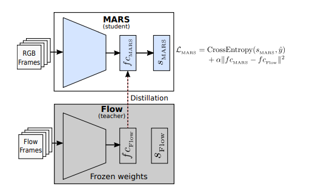

# Motion-Augmented RGB Stream [[CVPR 2019]](https://openaccess.thecvf.com/content_CVPR_2019/html/Crasto_MARS_Motion-Augmented_RGB_Stream_for_Action_Recognition_CVPR_2019_paper.html)


           |  
:-------------------------:|:-------------------------:

1. Training </br> 

- RGB Stream:  
```
  python MARS/MARS/train_Adam.py \
  --dataset HMDB51 --modality RGB \
  --n_classes 10 \
  --n_epochs 100 \
  --learning_rate 0.01 \
  --lr_patience 5 \
  --batch_size 32 --log 1 --sample_duration 16 \
  --model resnext --model_depth 101  \
  --frame_dir "/content/frame_flow" \
  --annotation_path "/content/drive/MyDrive/Human Action Recognition/testTrainMulti_7030_splits" \
  --checkpoint 10 \
  --result_path "results/" \
```  
If training from checkpoint, add checkpoint path to argument ```--resume_path1```.

- Flow Stream
  ```
  python MARS/MARS/train_Adam.py \
  --dataset HMDB51 --modality Flow \
  --n_classes 10 \
  --n_epochs 100 \
  --learning_rate 0.01 \
  --lr_patience 5 \
  --batch_size 32 --log 1 --sample_duration 16 \
  --model resnext --model_depth 101  \
  --frame_dir "/content/frame_flow" \
  --annotation_path "/content/drive/MyDrive/Human Action Recognition/testTrainMulti_7030_splits" \
  --checkpoint 10 \
  --result_path "results/" \
  ```
If training from checkpoint, add checkpoint path to argument ```--resume_path1```.  
- MERS:  
```
  python /MARS/MARS/MERS_train_Adam.py \
  --dataset HMDB51 --modality RGB_Flow \
  --n_classes 10 \
  --batch_size 16 \
  --n_epochs 50 \
  --learning_rate 0.01 \
  --lr_patience 10 \
  --MARS_alpha 10 \
  --log 1 --sample_duration 16 \
  --model resnext --model_depth 101 \
  --output_layers 'avgpool' \
  --frame_dir "/content/frame_flow" \
  --checkpoint 10 \
  --annotation_path "/content/drive/MyDrive/Human Action Recognition/testTrainMulti_7030_splits" \
  --resume_path1 "/content/drive/MyDrive/Human Action Recognition/checkpoints/Flow_Adam_lr_manual/lr0.01_epoch1050.pth" \
  --result_path "results/" \
```
If training from checkpoint, add checkpoint path to argument ```--MARS_resume_path```.  
- MARS:  
```
  python MARS/MARS/MARS_train_Adam.py \
  --dataset HMDB51 --modality RGB_Flow \
  --n_classes 10 \
  --batch_size 16 \
  --n_epochs 70 \
  --MARS_alpha 50 \
  --learning_rate 0.01 \
  --lr_patience 10 \
  --log 1 --sample_duration 16 \
  --model resnext --model_depth 101 \
  --output_layers 'avgpool' \
  --frame_dir "/content/frame_flow" \
  --checkpoint 10 \
  --annotation_path "/content/drive/MyDrive/Human Action Recognition/testTrainMulti_7030_splits" \
  --resume_path1 "/content/drive/MyDrive/Human Action Recognition/checkpoints/Flow_Adam_lr_manual/lr0.01_epoch1050.pth" \
  --result_path "results/" \
```  
If training from checkpoint, add checkpoint path to argument ```--MARS_resume_path```.  
2. Testing  
#### Single Stream:
- RGB Stream: 
```
  python /MARS/MARS/test_single_stream.py \
  --batch_size 1 --n_classes 10 \
  --only_RGB \
  --model resnext --model_depth 101 \
  --log 0 --dataset HMDB51 --modality RGB --sample_duration 16 --split 1  \
  --resume_path1 "/content/results/HMDB51/HMDB51_1_RGB_train_batch32_sample112_clip16_nestFalse_damp0.9_weight_decay0.001_manualseed1_modelresnext101_ftbeginidx4_varLR640.pth" \
  --frame_dir "/content/frame_flow" \
  --annotation_path "/content/drive/MyDrive/Human Action Recognition/testTrainMulti_7030_splits" \
  --result_path "results/"
```  
- Flow Stream: 
```
  python /MARS/MARS/test_single_stream.py \
  --batch_size 1 --n_classes 10 \
  --model resnext --model_depth 101 \
  --log 0 --dataset HMDB51 --modality Flow --sample_duration 16 --split 1 \
  --resume_path1 "/content/results/HMDB51/HMDB51_1_Flow_train_batch32_sample112_clip16_nestFalse_damp0.9_weight_decay0.001_manualseed1_modelresnext101_ftbeginidx4_varLR1050.pth" \
  --frame_dir "/content/frame_flow" \
  --annotation_path "/content/drive/MyDrive/Human Action Recognition/testTrainMulti_7030_splits" \
  --result_path "results/"
```
- MARS: 
```
  python /MARS/MARS/test_single_stream.py \
  --batch_size 1 --n_classes 10 \
  --only_RGB \
  --model resnext --model_depth 101 \
  --log 0 --dataset HMDB51 --modality RGB --sample_duration 16 --split 1  \
  --resume_path1 "/content/results/HMDB51/MARS_HMDB51_1_train_batch16_sample112_clip16_nesterovFalse_manualseed1_modelresnext101_ftbeginidx4_layeravgpool_alpha50.0_650.pth" \
  --frame_dir "/content/frame_flow" \
  --annotation_path "/content/drive/MyDrive/Human Action Recognition/testTrainMulti_7030_splits" \
  --result_path "results/"
```
#### Two Stream:
- RGB + Flow Stream:
```
  python /MARS/MARS/test_two_stream.py \
  --batch_size 1 --n_classes 10 \
  --modality RGB_Flow \
  --model resnext --model_depth 101 \
  --log 0 --dataset HMDB51 --sample_duration 16 --split 1  \
  --resume_path1 "/content/results/HMDB51/HMDB51_1_RGB_train_batch32_sample112_clip16_nestFalse_damp0.9_weight_decay0.001_manualseed1_modelresnext101_ftbeginidx4_varLR640.pth" \
  --resume_path2 "/content/results/HMDB51/HMDB51_1_Flow_train_batch32_sample112_clip16_nestFalse_damp0.9_weight_decay0.001_manualseed1_modelresnext101_ftbeginidx4_varLR1050.pth" \
  --frame_dir "/content/frame_flow" \
  --annotation_path "/content/drive/MyDrive/Human Action Recognition/testTrainMulti_7030_splits" \
  --result_path "results/"
```
- MARS + RGB Stream:
```
  python /MARS/MARS/test_two_stream.py \
  --batch_size 1 --n_classes 10 \
  --modality RGB \
  --only_RGB \
  --model resnext --model_depth 101 \
  --log 0 --dataset HMDB51 --sample_duration 16 --split 1  \
  --resume_path1 "/content/results/HMDB51/HMDB51_1_RGB_train_batch32_sample112_clip16_nestFalse_damp0.9_weight_decay0.001_manualseed1_modelresnext101_ftbeginidx4_varLR640.pth" \
  --resume_path2 "/content/results/HMDB51/MARS_HMDB51_1_train_batch16_sample112_clip16_nesterovFalse_manualseed1_modelresnext101_ftbeginidx4_layeravgpool_alpha50.0_650.pth" \
  --frame_dir "/content/frame_flow" \
  --annotation_path "/content/drive/MyDrive/Human Action Recognition/testTrainMulti_7030_splits" \
  --result_path "results/"
```
- MERS + RGB Stream:  
```
  python /MARS/MARS/test_two_stream.py \
  --batch_size 1 --n_classes 10 \
  --modality RGB \
  --only_RGB \
  --model resnext --model_depth 101 \
  --log 0 --dataset HMDB51 --sample_duration 16 --split 1  \
  --resume_path1 "/content/results/HMDB51/HMDB51_1_RGB_train_batch32_sample112_clip16_nestFalse_damp0.9_weight_decay0.001_manualseed1_modelresnext101_ftbeginidx4_varLR640.pth" \
  --resume_path2 "/content/results/HMDB51/MERS_HMDB51_1_batch16_sample112_clip16_lr0.01_nesterovFalse_manualseed1_modelresnext101_ftbeginidx4_layeravgpool_alpha50.0_100.pth" \
  --frame_dir "/content/frame_flow" \
  --annotation_path "/content/drive/MyDrive/Human Action Recognition/testTrainMulti_7030_splits" \
  --result_path "results/"
```

3. Main results

|  Stream  | HMDB10 | 
| :------: | :--------: | 
| RGB |  75.33  |  
| Flow |  51.33  |  
| MERS |  40  |  
| MARS | 72 |
| RGB + Flow | 78.67 |
| MARS + RGB | 77.33 |
| MERS + Flow | 51.33 |