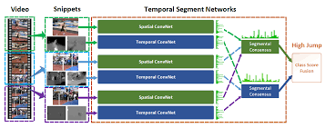

# Temporal Segments Network [[arXiv]](https://arxiv.org/abs/1608.00859)

1. Training
- RGB Stream:
```
  python /TSN/train.py \
  --modality "RGB" \
  --n_segments 4 \
  --n_classes 10 \
  --batch_size 32 \
  --lr_patience 10 \
  --learning_rate 0.1 \
  --reduce_lr \
  --n_epochs 50 \
  --checkpoint 50 \
  --frame_dir "/content/frame_flow" \
  --annotation_path "/content/drive/MyDrive/Human Action Recognition/testTrainMulti_7030_splits" \
  --result_path "results/" \
```  

- Flow Stream:  
```
  python /TSN/train.py \
  --modality "Flow" \
  --n_segments 4 \
  --n_classes 10 \
  --batch_size 32 \
  --lr_patience 10 \
  --learning_rate 0.1 \
  --reduce_lr \
  --n_epochs 200 \
  --checkpoint 20 \
  --frame_dir "/content/frame_flow" \
  --annotation_path "/content/drive/MyDrive/Human Action Recognition/testTrainMulti_7030_splits" \
  --resume_path1 "/content/results/HMDB51/HMDB51_1_Flow_train_batch32_varLR150.pth" \
  --result_path "results/" \
```
- If training from checkpoint, add checkpoint path to argument ```--resume_path1```.
2. Testing 
- RGB Stream: 
```
  python /TSN/test_single_stream.py \
  --modality "RGB" \
  --n_segments 4 \
  --n_classes 10 \
  --batch_size 1 \
  --n_epochs 1 \
  --frame_dir "/content/frame_flow" \
  --annotation_path "/content/drive/MyDrive/Human Action Recognition/testTrainMulti_7030_splits" \
  --resume_path1 "/content/results/HMDB51/HMDB51_1_RGB_train_batch32_varLR200.pth" \
  --result_path "results/" \
```
- Flow Stream:
```
  python /TSN/test_single_stream.py \
  --modality "Flow" \
  --n_segments 4 \
  --n_classes 10 \
  --batch_size 1 \
  --n_epochs 1 \
  --frame_dir "/content/frame_flow" \
  --annotation_path "/content/drive/MyDrive/Human Action Recognition/testTrainMulti_7030_splits" \
  --resume_path1 "/content/results/HMDB51/HMDB51_1_Flow_train_batch32_varLR200.pth" \
  --result_path "results/" \
```

- RGB + Flow Stream:
```
  python /TSN/test_two_stream.py \
  --modality "RGB_Flow" \
  --n_segments 4 \
  --n_classes 10 \
  --batch_size 1 \
  --n_epochs 1 \
  --frame_dir "/content/frame_flow" \
  --annotation_path "/content/drive/MyDrive/Human Action Recognition/testTrainMulti_7030_splits" \
  --resume_path1 "/content/results/HMDB51/HMDB51_1_RGB_train_batch32_varLR200.pth" \
  --resume_path2 "/content/results/HMDB51/HMDB51_1_Flow_train_batch32_varLR200.pth" \
  --result_path "results/" \
```

3. Main results 

|  Stream  | HMDB10 | 
| :------: | :--------: | 
| RGB |  75.33  |  
| Flow |  51.33  |
| RGB + Flow | **77.33** |
