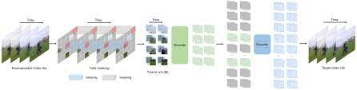

# Video Masked Autoencoders (VideoMAE) [[arXiv]](https://arxiv.org/abs/2203.12602)

## 🔨 Installation

Please follow the instructions in [INSTALL.md](INSTALL.md).

## ➡️ Data Preparation

Please follow the instructions in [DATASET.md](DATASET.md) for data preparation.

## 🔄 Pre-training

The pre-training instruction is in [PRETRAIN.md](PRETRAIN.md).

## ⤴️ Fine-tuning with pre-trained models

The fine-tuning instruction is in [FINETUNE.md](FINETUNE.md).

## 👇 Results

|  Method  |  Extra Data  | Backbone | UCF101 | HMDB51 |
| :------: | :----------: | :------: | :----: | :----: |
| VideoMAE |   ***no***   |  ViT-B   |  90.8  |  61.1  |
| VideoMAE | Kinetics-400 |  ViT-B   |  96.1  |  73.3  |
